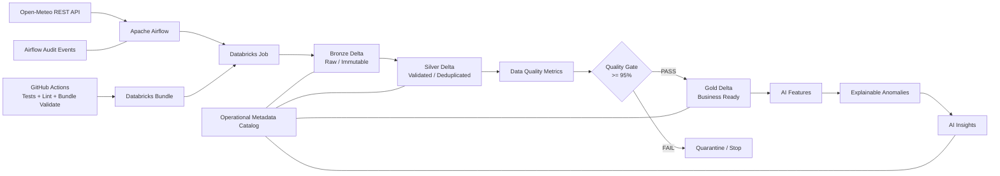

# Weather Data Integration & Analytics Platform

**Phase 7 — Production Engineering**

An end-to-end, production-oriented Data Engineering platform that ingests weather data from **Open-Meteo**, processes it with **Databricks / PySpark**, stores trusted datasets in **Delta Lake**, orchestrates the workflow with **Apache Airflow**, applies **data quality gates**, publishes **analytics and AI products**, and validates the platform through automated tests and CI/CD.

> The project is intentionally incremental: each phase adds a production capability while preserving the previous architecture.

## Project evolution

| Phase | Capability |
|---|---|
| Phase 1 | MVP — REST/JSON ingestion, PySpark transformation, PostgreSQL |
| Phase 2 | Data Engineering — Bronze/Silver/Gold, schema, quality and quarantine |
| Phase 3 | Advanced Data Engineering — incremental/idempotent Delta processing and quality metrics |
| Phase 4 | Engineering — Databricks Bundles, DEV/PROD and CI/CD |
| Phase 5 | AI/ML — feature engineering, anomaly detection and optional LLM insights |
| Phase 6 | Orchestration — Apache Airflow triggers and monitors the Databricks workflow |
| **Phase 7** | **Production Engineering — quality gates, operational metadata, observability and production-oriented testing** |

## Phase 7 goals

Phase 7 focuses on making the platform safer to operate and easier to troubleshoot:

1. **Data Quality Gate** — downstream processing stops when quality falls below the configured threshold.
2. **Operational Metadata** — a project-local data catalog documents datasets, layers and columns.
3. **Observability** — Airflow emits structured success/failure audit events.
4. **Reliable retries** — Airflow retries are combined with the idempotent Delta processing introduced in Phase 3.
5. **Automated validation** — CI executes unit tests, static checks and Databricks Bundle validation.
6. **Operational smoke test** — the deployed Databricks workflow verifies that critical production artifacts exist and the latest quality gate passed.

The Bronze → Silver → Gold model follows the Databricks-recommended medallion pattern, where data quality progressively improves through the layers.

## Architecture



See:

- `architecture/architecture.md`
- `docs/diagrams/architecture-phase7.mmd`

## Technology stack

| Layer | Technology |
|---|---|
| Source | Open-Meteo REST API |
| Orchestration | Apache Airflow |
| Processing | Databricks / PySpark |
| Storage | Delta Lake / Unity Catalog |
| Data architecture | Bronze / Silver / Gold |
| Data quality | PySpark rules, quarantine, quality metrics and quality gate |
| AI/ML | Feature engineering, statistical anomaly detection, optional LLM insights |
| CI/CD | GitHub Actions |
| Deployment | Databricks Declarative Automation Bundles |
| Testing | PyTest + Ruff + Databricks smoke tests |
| Local infrastructure | Docker Compose |

## Data architecture

### Bronze

`weather_bronze` stores raw Open-Meteo snapshots with ingestion metadata and deterministic snapshot IDs.

Purpose:

- preserve source fidelity;
- support auditability;
- support reprocessing;
- make ingestion idempotent.

### Silver

`weather_silver` contains typed hourly observations.

Processing includes:

- JSON parsing;
- type conversion;
- deduplication;
- incremental processing;
- Delta upsert.

Invalid records are retained in `weather_quarantine` rather than silently discarded.

### Quality

Phase 7 introduces an explicit control point:

```text
weather_quality_metrics
          |
          v
weather_quality_gate
          |
     +----+----+
     |         |
   PASS       FAIL
     |         |
     v         v
   Gold      STOP
```

Default threshold:

```text
95%
```

It can be changed through the Databricks Bundle variable `min_quality_score`.

Delta Lake supports `MERGE` for upserts, which is used by the incremental pipeline to make retries safe.

### Gold

`weather_daily_gold` contains analytics-ready daily aggregates.

### AI

The AI layer remains downstream of trusted data:

```text
Gold
  |
  v
AI Features
  |
  v
Anomaly Detection
  |
  v
AI Insights
```

The optional LLM path does not become a dependency for ingestion or data quality.

## Phase 7 datasets

| Dataset | Layer | Purpose |
|---|---|---|
| `weather_bronze` | Bronze | Raw source snapshots |
| `weather_silver` | Silver | Trusted hourly observations |
| `weather_quarantine` | Quality | Invalid records |
| `weather_quality_metrics` | Quality | Historical quality measurements |
| `weather_quality_gate` | Quality | Pass/fail decision for downstream processing |
| `weather_daily_gold` | Gold | Daily analytics |
| `weather_ai_features` | AI | ML/AI feature dataset |
| `weather_ai_anomalies` | AI | Explainable anomaly detection |
| `weather_ai_insights` | AI | Operational insights |
| `weather_data_catalog` | Metadata | Table/column metadata |

## Repository structure

```text
weather-data-integration/
├── airflow/
│   ├── dags/
│   │   └── weather_pipeline.py
│   ├── config/
│   ├── logs/
│   ├── Dockerfile
│   ├── docker-compose.yml
│   └── requirements.txt
│
├── architecture/
│   ├── architecture.md
│   └── data-model.md
│
├── config/
│   ├── dev.example.yml
│   └── prod.example.yml
│
├── databricks/
│   ├── notebooks/
│   │   ├── phase1/
│   │   ├── phase2/
│   │   ├── phase3/
│   │   ├── phase4/
│   │   ├── phase5/
│   │   └── phase7/
│   └── resources/
│
├── docs/
│   ├── diagrams/
│   ├── phase1.md
│   ├── phase2.md
│   ├── phase3.md
│   ├── phase4.md
│   ├── phase5.md
│   ├── phase6.md
│   ├── phase7.md
│   └── setup.md
│
├── src/
├── tests/
├── sql/
├── scripts/
├── .github/workflows/
├── databricks.yml
├── docker-compose.yml
├── requirements.txt
└── README.md
```

## Phase 7 notebooks

### 1. Data Quality Gate

`databricks/notebooks/phase7/01_data_quality_gate.py`

Reads the latest quality metrics and creates `weather_quality_gate`.

The notebook fails the Databricks task when:

```text
quality_score < min_quality_score
```

This means Gold and AI processing cannot silently continue after a quality regression.

### 2. Operational Metadata

`databricks/notebooks/phase7/02_operational_metadata.py`

Builds `weather_data_catalog` from the actual Spark schemas available in the environment.

### 3. Operational Smoke Test

`databricks/notebooks/phase7/03_operational_smoke.py`

Checks that critical datasets exist and that the latest quality gate is `PASS`.

## Airflow — Phase 7

The Airflow DAG is:

```text
weather_data_integration_phase7
```

Flow:

```text
start
  |
  v
Databricks Weather Job
  |
  v
success
```

Airflow remains the orchestration layer; the Databricks job owns the Spark/Delta workflow. Airflow tasks represent units of execution and dependencies, which is the core Airflow DAG model.

### Scheduling

```text
0 * * * *
```

The Databricks-native schedule remains paused because Airflow owns scheduling. This avoids two independent schedulers launching the same pipeline.

### Retries

```text
retries: 2
retry_delay: 5 minutes
max_active_runs: 1
```

Retries are safe because the underlying Delta ingestion and transformation are designed to be idempotent.

### Airflow audit events

The local deployment writes structured events to:

```text
airflow/logs/weather_pipeline_audit.jsonl
```

Example event categories:

```text
DAG_SUCCESS
DAG_FAILURE
```

The helper is intentionally simple so it can later be replaced by an enterprise logging or observability backend.

## Configure Airflow → Databricks

Create the Airflow connection:

```text
databricks_default
```

Configure it with the Databricks workspace host and authentication method. Do not commit tokens.

Set:

```text
weather_databricks_job_id
```

to the ID of the deployed Databricks job.

Then start Airflow:

```bash
cd airflow
docker compose up --build
```

Open the Airflow UI on port `8080` and unpause:

```text
weather_data_integration_phase7
```

## Local tests

Create the Python environment:

### Windows PowerShell

```powershell
python -m venv .venv
.\.venv\Scripts\Activate.ps1
pip install -r requirements.txt
```

### Linux / WSL

```bash
python3 -m venv .venv
source .venv/bin/activate
pip install -r requirements.txt
```

Run tests:

```bash
pytest -q
```

Run static checks:

```bash
ruff check src tests airflow/dags
```

## CI/CD

GitHub Actions validates the project before deployment.

```text
Pull Request / push
        |
        +--> PyTest
        |
        +--> Ruff
        |
        +--> Databricks Bundle validation
        |
        v
     develop
        |
        v
       DEV
        |
        v
      main
        |
        v
       PROD
```

Required GitHub secrets:

```text
DATABRICKS_HOST
DATABRICKS_TOKEN
```

The project never stores these values in Git.

## DEV / PROD

Databricks Bundle targets:

```text
dev  -> weather_dev
prod -> weather_prod
```

The quality threshold is shared as a deployment variable and can be adjusted per environment when needed.

## Security

- Do not commit API tokens, Databricks tokens or passwords.
- Use Airflow Connections for Airflow credentials.
- Use Databricks authentication/secrets for Databricks credentials.
- Keep local PostgreSQL protected by authentication/firewall controls if exposed outside Docker.
- Treat the local JSONL audit log as a development artifact; production deployments should use centralized protected logging.

## Why Phase 7 matters

The main architectural change is not another transformation. It is the introduction of **operational controls around the data product**:

```text
Data Pipeline
     |
     +--> Data Quality
     +--> Quality Gate
     +--> Metadata
     +--> Observability
     +--> Automated Tests
     +--> Safe Retries
```

This moves the project toward the engineering practices expected from production Data Engineering platforms.

## References

The architecture follows current Databricks guidance around medallion lakehouse design, data quality and Delta Lake operations.

## Next phase ideas

Potential Phase 8 directions:

- Infrastructure as Code;
- cloud object-storage landing zone;
- centralized observability;
- data lineage and governance;
- environment-specific catalogs;
- automated data contracts;
- integration with a managed PostgreSQL or warehouse target.
