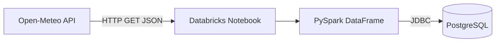
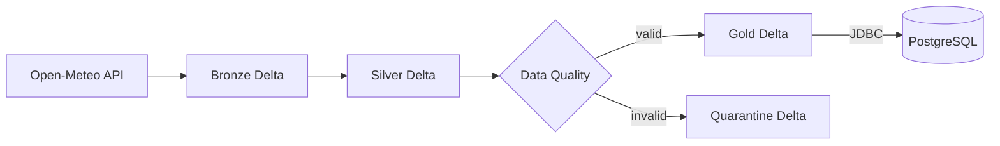

# Architecture

## Phase 1 — MVP



## Phase 2 — Data Engineering



## Logical data flow

```text
Source
  |
  | REST / JSON
  v
Bronze
  |
  | schema + normalization + deduplication
  v
Silver
  |
  +---- invalid ----> Quarantine
  |
  +---- valid ------> Gold
                          |
                          | JDBC
                          v
                      PostgreSQL
```

## Design principles

- Raw data is preserved before transformation.
- Transformations are deterministic and idempotent.
- Data quality failures do not silently disappear.
- Environment configuration is externalized.
- Secrets are never stored in Git.
- The same transformation code is intended for DEV and PROD.
